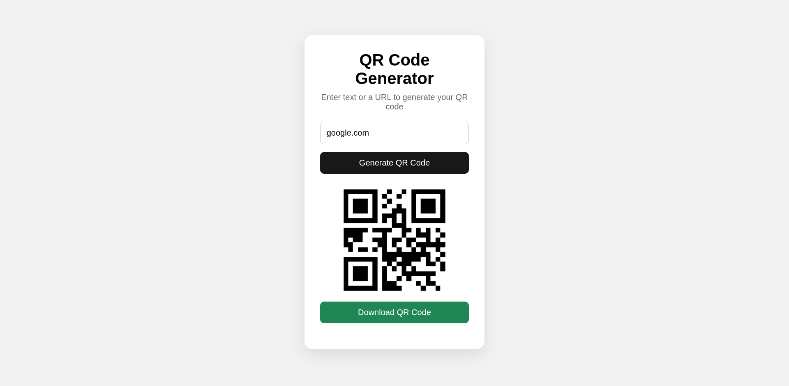

# QR Code Generator

Turn text or a URL into a downloadable QR code.

## Try it

1. Open [`index.html`](index.html).
2. Enter text or a URL and select **Generate QR Code**.
3. Select **Download QR Code** to save the PNG.

Uses the public `api.qrserver.com` service. Built with HTML, CSS, and JavaScript.
