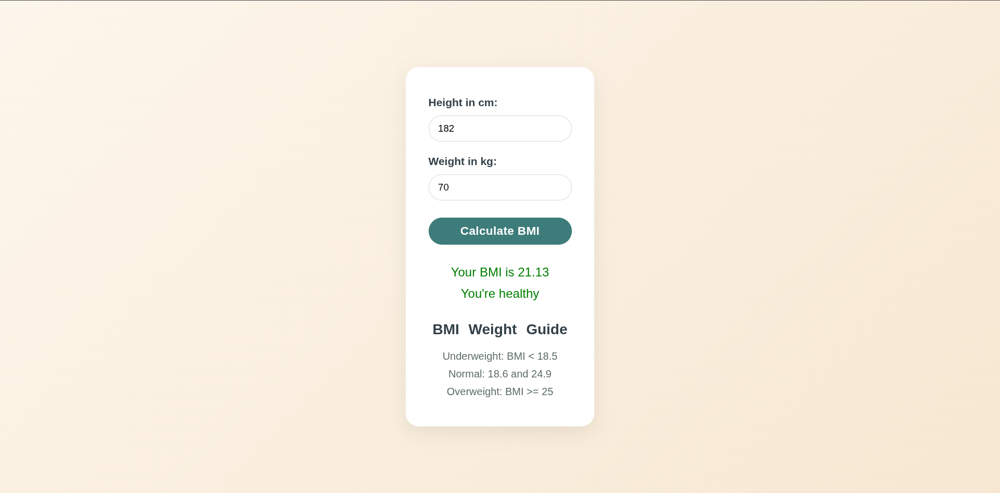

# BMI Calculator

Enter height in centimeters and weight in kilograms to get a BMI value and category.

[Open live demo](https://bmi-calculator-rust-five.vercel.app/)

## Try it

1. Open [`index.html`](index.html), or use the live demo.
2. Enter positive height and weight values.
3. Select **Calculate BMI** to see the result and category.

The calculator validates input and uses `weight / ((height * height) / 10000)`. Results are shown to two decimal places with the standard BMI ranges:

| BMI | Category |
|---|---|
| Below 18.5 | Underweight |
| 18.5–24.9 | Healthy |
| 25–29.9 | Overweight |
| 30 and above | Obese |

Built with HTML, CSS, and JavaScript. No build tools or dependencies required.
