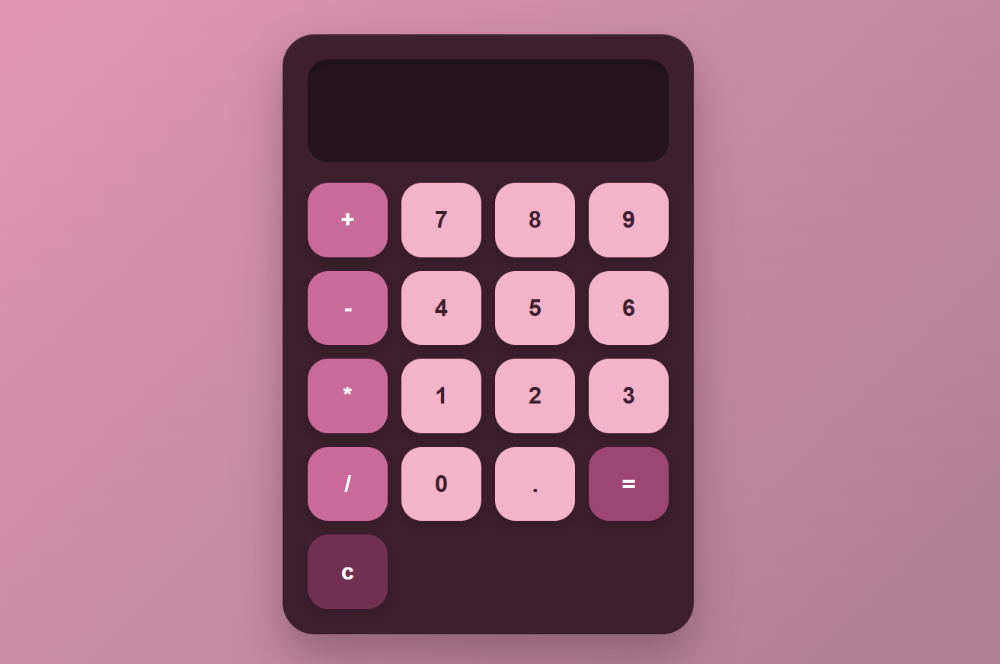
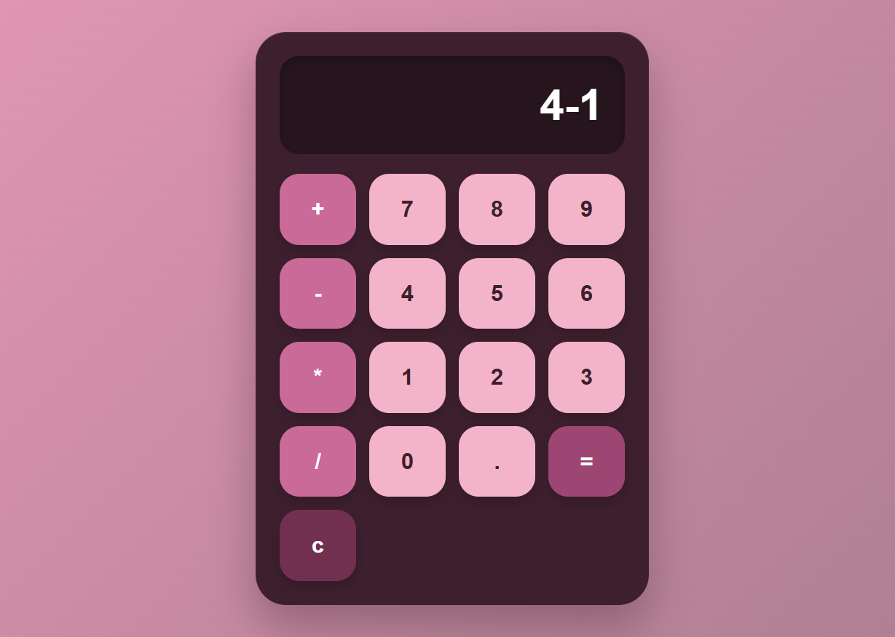
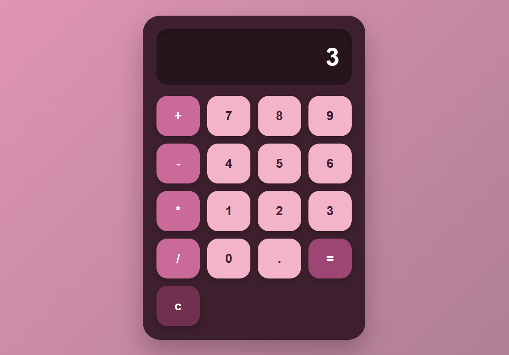

# Calculator

A simple and responsive calculator web application built with **HTML, CSS, and Vanilla JavaScript**. It features a sleek dark, cyberpunk-inspired interface with neon magenta and cyan accents.

## 📸 Screenshots

<p align="center">
  
  
  
</p>

## ✨ Features

* ➕ Addition
* ➖ Subtraction
* ✖️ Multiplication
* ➗ Division
* 🧹 Clear (`C`) functionality
* ⌫ Delete (`DEL`) functionality
* ⌨️ Keyboard input support
* 📱 Responsive design for mobile and desktop
* 🌙 Dark cyberpunk-inspired UI
* 💫 Neon magenta and cyan visual effects
* ⚡ No external dependencies

## 🛠️ Tech Stack

| Technology     | Purpose                             |
| -------------- | ----------------------------------- |
| **HTML5**      | Page structure                      |
| **CSS3**       | Styling, layout & animations        |
| **JavaScript** | Calculator logic & DOM manipulation |

## 📂 Project Structure

```text
calculator/
├── sshots/
│   ├── pic1.png
│   ├── pic2.png
│   └── pic3.png
├── favicon.png
├── index.html
├── style.css
├── script.js
└── README.md
```

## ⚙️ Installation & Usage

### 1. Clone the repository

```bash
git clone https://github.com/AtibaYounus/calculator.git
```

### 2. Navigate to the project directory

```bash
cd calculator
```

### 3. Run the project

Open `index.html` directly in your browser.

No build process, package installation, or external dependencies are required.

## 🧑‍💻 Author

**Atiba Younus**

GitHub: [@AtibaYounus](https://github.com/AtibaYounus)

## 📄 License

This project is open source and available under the **MIT License**.
