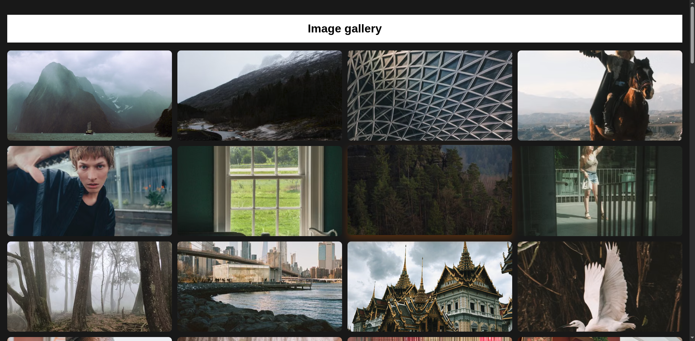

# Image Gallery

A responsive gallery that loads curated photos from the Pexels API through a small Express server.



**Live demo:** [img-gallery-opal.vercel.app](https://img-gallery-opal.vercel.app/)

## Run locally

```bash
cd server
npm install
```

Create `server/.env`:

```env
My_Pexels_API_Key=your_pexels_api_key
PORT=3000
```

Start the API:

```bash
npm run dev
```

Then open `client/index.html` in a browser. The client requests images from `http://localhost:3000/api/images`.

## Structure

- `client/` - gallery markup, styles, and browser code
- `server/` - Express API and Pexels integration
