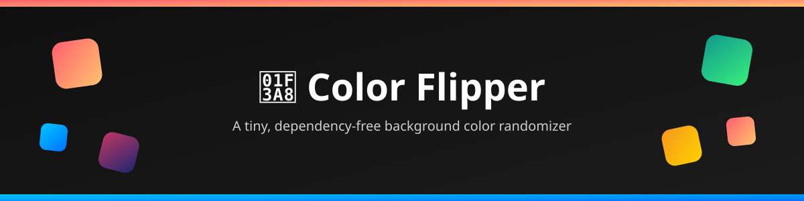

<div align="center">



# Color Flipper

**A simple, zero-dependency vanilla JS app that flips your page's background through random hex colors — press Start to go, Stop to freeze.**

[](https://developer.mozilla.org/en-US/docs/Web/HTML)
[](https://developer.mozilla.org/en-US/docs/Web/CSS)
[](https://developer.mozilla.org/en-US/docs/Web/JavaScript)
[](#)

[Live Portfolio](https://my-portfolio-alpha-lemon-96.vercel.app/) · [GitHub](https://github.com/simplysaadali) · [Report a Bug](../../issues) · [Request a Feature](../../issues)

</div>

---

## Overview

**Color Flipper** does exactly one thing, and does it well: it cycles your browser's background through a fresh random hex color every **500ms** until you tell it to stop. No frameworks, no build step, no npm install — just open the HTML file and go.

|  |  |
|---|---|
| 🖱️ **Interaction** | One click to start, one click to stop |
| 🎲 **Color source** | Randomly generated 6-digit hex (`#A1B2C3` style) |
| ⚡ **Refresh rate** | Every 500 milliseconds |
| 📦 **Dependencies** | Zero — pure HTML, CSS & JS |
| 📱 **Responsive** | Adapts down to small mobile screens |

---

## Demo

> Open `index.html` in any modern browser and click **Start**.

```
┌─────────────────────────────┐
│   Color Flipper   Portfolio GitHub │
├─────────────────────────────┤
│                             │
│   Click Start to begin...  │
│                             │
│      [ Start ]  [ Stop ]   │
│                             │
└─────────────────────────────┘
        🎨 background color
       shuffles every 0.5s
```

---

## Tech Stack

| Layer | Technology |
|---|---|
| Structure | HTML5 |
| Styling | CSS3 (Flexbox + Media Queries) |
| Behavior | Vanilla JavaScript (`setInterval` / `clearInterval`) |

---

## Project Structure

```
color-flipper/
├── index.html      # Page markup + nav + Start/Stop buttons
├── style.css       # Styling, layout & responsive breakpoints
├── script.js       # Random color generator + start/stop logic
├── banner.svg       # README banner artwork
└── README.md       # You are here
```

---

## How It Works

1. `randomColor()` builds a random 6-character hex string from `0-9A-F`.
2. **Start** kicks off a `setInterval` that repaints `document.body.style.backgroundColor` every 500ms.
3. **Stop** clears that interval, freezing the current color.

```js
const randomColor = () => {
  const hex = "0123456789ABCDEF";
  let color = "#";
  for (let i = 0; i < 6; i++) {
    color += hex[Math.floor(Math.random() * 16)];
  }
  return color;
};
```

---

## Run Locally

No installs, no dependencies — just clone and open.

```bash
# Clone the repo
git clone https://github.com/simplysaadali/color-flipper.git

# Move into the project folder
cd color-flipper

# Open it in your browser
open index.html      # macOS
start index.html      # Windows
xdg-open index.html   # Linux
```

Or serve it with any static server, e.g.:

```bash
npx serve .
```

---

## Controls

| Button | Action |
|---|---|
| **Start** 🟢 | Begins cycling the background through random colors |
| **Stop** 🔴 | Freezes on whatever color is currently showing |

---

## Responsive Design

The layout adapts across breakpoints so it stays usable on tablets and phones:

- **≤ 768px** — nav stacks vertically, buttons and text scale down
- **≤ 420px** — further size reduction for small phone screens

---

## Roadmap Ideas

- [ ] Adjustable speed slider (control the flip interval)
- [ ] Display the current hex code on screen
- [ ] "Copy color" button to grab the hex value
- [ ] Color palette / history of last N colors
- [ ] Dark/light theme toggle for the nav

*(Contributions welcome — see below!)*

---

## Contributing

Contributions, issues, and feature requests are welcome!

1. Fork the project
2. Create your feature branch (`git checkout -b feature/amazing-thing`)
3. Commit your changes (`git commit -m "Add amazing thing"`)
4. Push to the branch (`git push origin feature/amazing-thing`)
5. Open a Pull Request
